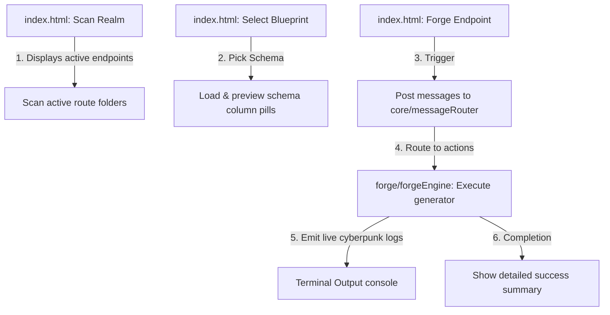

# The Endpoint Forge - Architecture & Narrative

Welcome to **The Endpoint Forge** directory. This system is designed around the metaphor of code-smithing: taking database schema blueprints and forging active route nodes (API endpoints) inside the workspace.

---

## 🌌 The Narrative Flow

---

## 📁 Directory Structure & Roles

The codebase is split into three clean layers to isolate concerns, maximize readability, and ease maintenance:

### 1. Backend Core (`backend/core/`)
Manages structural interface tasks, VS Code interactions, and message dispatching:
- **`readHtml.js`**: The main extension activation handler that sets up the webview panel.
- **`htmlLoader.js`**: Serves `index.html` and hooks the ES Module entry point [forgeController.js](./frontend/js/forgeController.js) using webview URIs.
- **`workspaceHelper.js`**: Resolves local environment configuration (root path, schema paths, port settings).
- **`messageRouter.js`** & **`messageRouter/`**: Orchestrates switch-case checks and forwards incoming webview messages to action handlers.

### 2. Backend Forge (`backend/forge/`)
Houses the domain logic for generating files and scanning resources:
- **`schemaScanner.js`**: Reads local JSON schemas, returning parsed table names and top 15 columns for UI preview.
- **`routeScanner.js`**: Scans the project's existing imports to check which endpoints are already active.
- **`forgeEngine.js`**: Executes the code generator while outputting sequential logs (e.g. `🌌 Initializing...`, `📜 Reading blueprint...`) to simulate a physical terminal forge.

### 3. Frontend Client (`frontend/`)
Provides a glassmorphism interface powered by standard browser ES modules:
- **`index.html`**: A three-step responsive screen utilizing Tailwind CSS, JetBrains Mono, and Plus Jakarta Sans.
- **`js/vscodeBridge.js`**: Handles communication with the VS Code API.
- **`js/forgeActions.js`**: Performs input validations and issues action dispatch calls.
- **`js/forgeController.js`**: Orchestration entry module that hooks message event listeners and delegates UI rendering.
- **`js/uiPresenter/`**: Set of micro-modules for controlling statuses, warnings, logs, and report views.
- **`js/renderers/`**: Set of micro-modules for painting grids, sidebar cards, and column map previews.

---

## 🛠️ Design Patterns Applied

1. **Orchestrator Pattern**: Main modules (`messageRouter.js`, `forgeController.js`, `uiPresenter.js`) only contain dispatch or aggregation logic, delegating heavy operations to micro-modules.
2. **Standard ES Modules (ESM)**: Eliminates bundled script dependencies in the webview, enabling native browser-based script resolving.
3. **Glassmorphism Theme**: Uses rich radial gradients, transparent slate borders, and customized vibrant glowing states for premium visual aesthetics.
